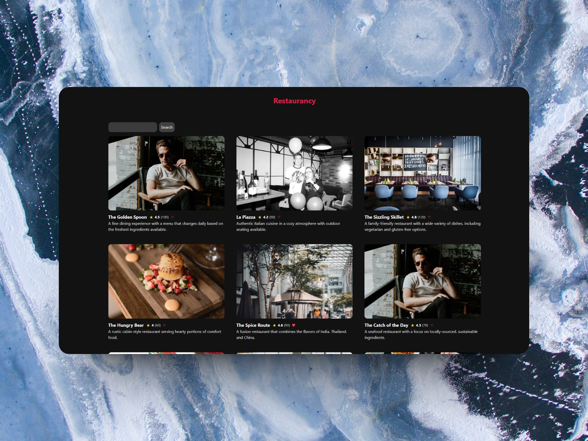

  
# 🔺 Beginning of Next.js - Restaurancy

### 🪐 Este es un proyecto introductorio a Next.js que abarca las últimas novedades de Next 14.

> 🧩 Aquí puedes ver su [**Live Demo.**](https://restaurancy-abrahamgalue.vercel.app/)

## 🚀 Descripción

Curso introductorio a Next.js con App Router.

Construyendo una aplicación de reseñas de restaurantes.

## 🎭 Contenidos

El proyecto utiliza los siguientes aspectos de Next.js:

- Server y Client Components
- Utilizando las **rutas dinámicas** que nos ofrece Next
- Estados de carga, manejo de errores
- Uso de una base de datos en Sheets Google
- URL Params
- Server Actions, agregados en Next 14 para comunicarse con la bdd
